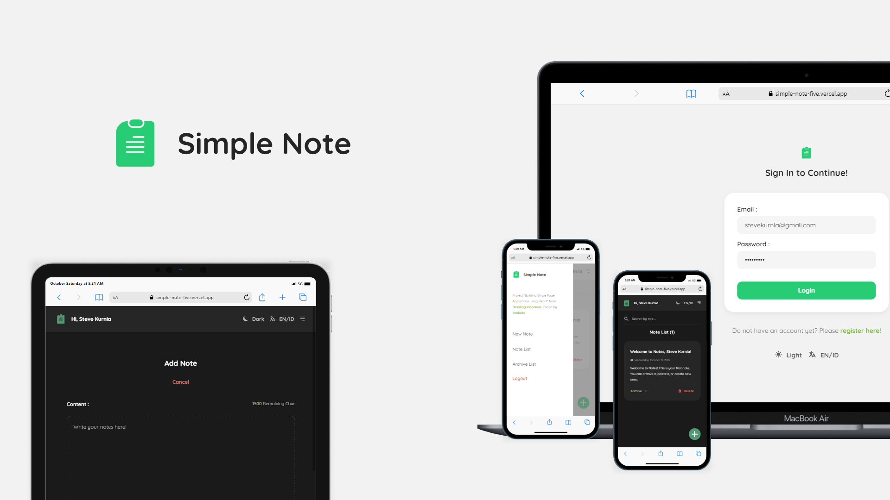

# Dicoding Submission - Simple Note

This is submission project "Building Single Page Application using React" from [Dicoding Indonesia](https://www.dicoding.com/).

## Features

- Added Notes
- Archiving Notes
- Delete Notes
- Display Active / Archive Notes
- Search Notes by Title
- User Registration and Authentication
- Change Dark / Light Appearance
- Switch to English / Indonesian

## What I learned

- Validate the props component using PropTypes.
- Creating client-side routing using the React Router ecosystem.
- Utilize lifecycle methods to get data from APIs inside components.
- Accessible global state without props drilling practice using React Context.
- Write better React code by maximizing the use of functional components through Hooks.

## Links

- Live URL : [https://simple-note-five.vercel.app/](https://simple-note-five.vercel.app/)
- Repository : [https://github.com/cholis04/simple-note](https://github.com/cholis04/simple-note)

## Author

- Website - [https://cholis04.github.io](https://cholis04.github.io)
- Frontend Mentor - [@cholis04](https://www.frontendmentor.io/profile/cholis04)
- Codepen - [cholis04](https://codepen.io/cholis04)
- Dicoding - [cholis04](https://www.dicoding.com/users/cholis04)
- Dribbble - [cholis04](https://dribbble.com/cholis04)
- Instagram - [@cholis04](https://instagram.com/cholis04)
